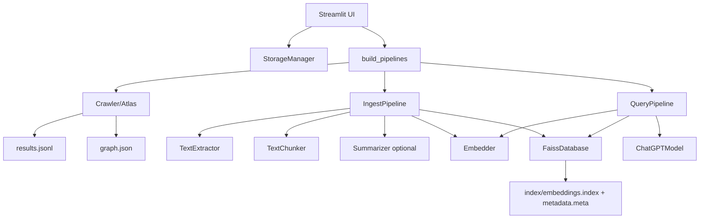
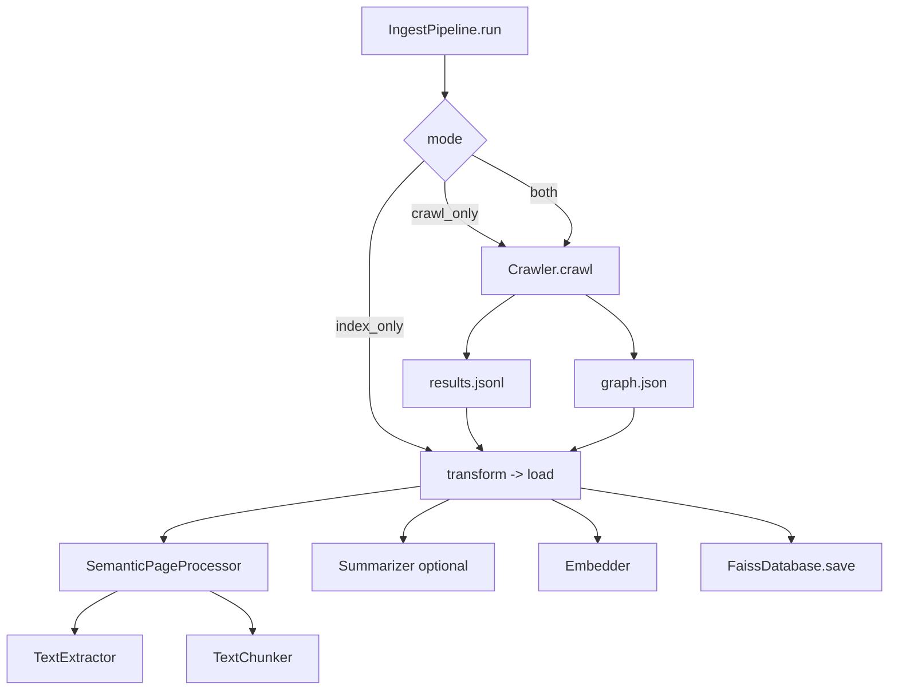
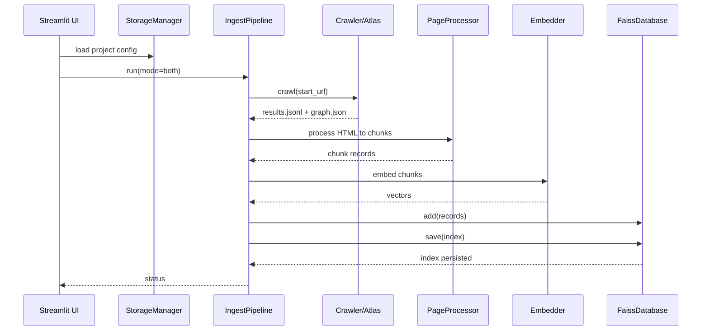
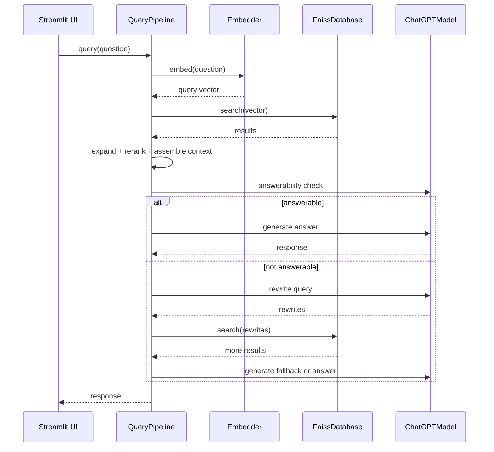

# Webly Logic and Component Diagrams

This document describes the runtime logic, component responsibilities, and data flow in Webly. It is focused on how things work (not just what exists), with diagrams for crawl, ingest, indexing, and query.

## System Overview
Webly converts a website into a searchable knowledge base and chat interface:
- Crawl HTML pages and build a site graph.
- Extract readable text and chunk it with structural context.
- Optionally summarize chunks.
- Embed chunks into vectors and store them in FAISS.
- Retrieve relevant chunks for queries and answer via LLM.
- Provide a Streamlit UI to manage projects and chats.

## Component Responsibilities

### UI Layer (`app.py`)
- Manages projects and per-project configs in `websites_storage/`.
- Runs crawl/index jobs and reports readiness.
- Manages chat sessions and history.
- Orchestrates query flow: ensures index exists, loads index if needed, runs query pipeline, saves responses.

### Pipeline Factory (`main.py`)
- `build_pipelines(config, api_key=None)` wires all components based on config.
- Resolves defaults for `embedding_model` and `chat_model`.
- Chooses HF or OpenAI embedder.
- Creates `Crawler`, `IngestPipeline`, `WeblyChatAgent`, and `QueryPipeline`.

### Crawl Layer (`crawl/` + `webcreeper/`)
- `Crawler` wraps WebCreeper Atlas with project-specific settings.
- `Atlas`:
  - Enforces domain/robots/path/pattern policies.
  - Fetches HTML and extracts links (anchors).
  - Deduplicates by text hash per run.
  - Saves results to `results.jsonl` and graph to `graph.json`.

### Processing Layer (`processors/`)
- `TrafilaturaTextExtractor`: converts HTML to readable text (with CF email de-obfuscation).
- `SlidingTextChunker`: splits content into section-aware chunks.
- `SemanticPageProcessor`: creates chunk records with hierarchy and outgoing links.
- `TextSummarizer`: optional LLM summarization per chunk.

### Embedding Layer (`embedder/`)
- `HFSentenceEmbedder`: uses SentenceTransformers and normalizes vectors.
- `OpenAIEmbedder`: uses OpenAI embeddings; requires API key.

### Vector Store (`vector_index/`)
- `FaissDatabase`: stable 64-bit ids, add/search/delete/update, save/load.
- Stores `embeddings.index` and `metadata.meta` under `index/`.

### Query Layer (`pipeline/query_pipeline.py` + `chatbot/`)
- `QueryPipeline`: retrieval + graph/section expansion + reranking + answerability gating.
- `WeblyChatAgent`: builds prompts, optional query rewrite, answerable checks.
- `ChatGPTModel`: LLM wrapper for response generation.

### Storage Layer (`storage/storage_manager.py`)
- Handles project config files and chat histories.
- Creates per-project folder layout under `websites_storage/`.

## Primary Runtime Logic

### 1) Project Creation (UI)
- User enters start URL, allowed domains, and model settings.
- `StorageManager.create_project()` writes `config.json` and creates `index/` and `chats/`.
- UI sets this project as active and builds pipelines with config.

### 2) Crawl + Index Run (Ingest)
- UI calls `IngestPipeline.run(mode)`.
- `extract()`:
  - Calls `Crawler.crawl()` (Atlas) with callbacks.
  - Results stream into `results.jsonl`.
  - Link graph saved as `graph.json`.
- `transform()`:
  - Reads `results.jsonl` (or `.json` fallback).
  - Loads `graph.json` to derive incoming links for each page.
  - `SemanticPageProcessor` builds structured chunks.
  - Optional summarization replaces chunk text for embedding.
  - Long text is split into embedding-safe segments.
- `load()`:
  - Adds records to FAISS and saves index + metadata.

### 3) Query (Chat)
- UI ensures index exists and loads it if missing from memory.
- `QueryPipeline.query(question)`:
  - Embed question, search FAISS.
  - Expand results using:
    - incoming links (anchor text)
    - section headings
  - Optionally rewrite the query and perform a second-pass search.
  - Re-rank with boosts and dedupe by page.
  - Assemble a context string grouped by top heading.
  - Use LLM to judge answerability. If answerable, generate response; else return a fallback with links.
- UI saves Q/A pair to chat history.

## Diagrams

### System Flow (End-to-End)


### Ingest Pipeline (Detailed)


### Query Pipeline (Detailed)
```mermaid
flowchart TD
  A[QueryPipeline.query] --> B[Embed question]
  B --> C[FAISS search (initial)]
  C --> D[Expand via graph anchors]
  C --> E[Expand via section headings]
  D --> F[Combine + rerank]
  E --> F
  F --> G[Assemble context]
  G --> H[Answerability check]
  H -->|YES| I[Chatbot.generate]
  H -->|NO| J[Rewrite query]
  J --> K[Second-pass search + expand]
  K --> F
  H -->|NO after hops| L[Fallback + links]
```


### Sequence Diagrams

#### Crawl + Index Run


#### Query Flow


### Storage Layout
```
websites_storage/
  <project>/
    config.json
    results.jsonl
    graph.json
    debug/
      raw_chunks.jsonl
      summaries_full.jsonl
    index/
      embeddings.index
      metadata.meta
    chats/
      <chat>.json
```

## Component-Level Logic Notes

### Crawler and Atlas
- `Crawler.crawl()` delegates to Atlas and passes a callback.
- Atlas performs:
  - URL normalization and scheme filtering.
  - Domain allow-list enforcement.
  - Path allow/block list checks.
  - Optional robots.txt checks via BaseAgent.
  - Deduplication by content hash (per run).
- Writes `results.jsonl` entries `{url, html, length}`.
- Writes `graph.json` mapping URL -> list of `{target, anchor_text, source_chunk}`.

### Page Processing and Chunking
- HTML is cleaned by removing navigation and layout elements.
- Headings define section hierarchy; each chunk carries `hierarchy`.
- Chunks include outgoing links within that section.
- Deterministic chunk IDs from `url + hierarchy + local_index`.

### Summarization
- Optional and configured by `summary_model`.
- The summarizer truncates input by token count to avoid model errors.
- If summarization fails, pipeline falls back to raw text.

### Embedding and Indexing
- Embedding input is split into safe-size segments when long.
- Each segment becomes a separate record with parent chunk id in metadata.
- FAISS stores normalized vectors for cosine similarity.
- Stable IDs are derived from deterministic keys to support update/delete.

### Retrieval and Answering
- Initial semantic search uses `top_k_first_pass`.
- Graph expansion uses incoming anchor text to form new search queries.
- Section expansion uses top-level headings to broaden retrieval.
- Reranking boosts anchor/section sources and limits per page.
- Context assembly groups by section heading for clarity.
- If answerability is low, the pipeline attempts query rewrite.

## Error and Fallback Behavior
- If results file missing or empty after crawl, `IngestPipeline.run()` returns a structured error dict (no exception).
- If index missing at query time, UI returns a friendly message and prompts to run indexing.
- Query pipeline returns a fallback message with helpful URLs when it cannot answer confidently.

## Extending the Logic
- Swap embedders by implementing `Embedder` and updating config.
- Swap chunker/extractor in `IngestPipeline`.
- Add new vector stores via `VectorDatabase` interface.
- Add new UI settings and persist them to `config.json`.
